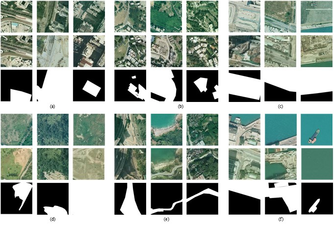
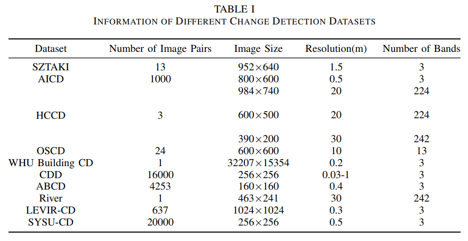
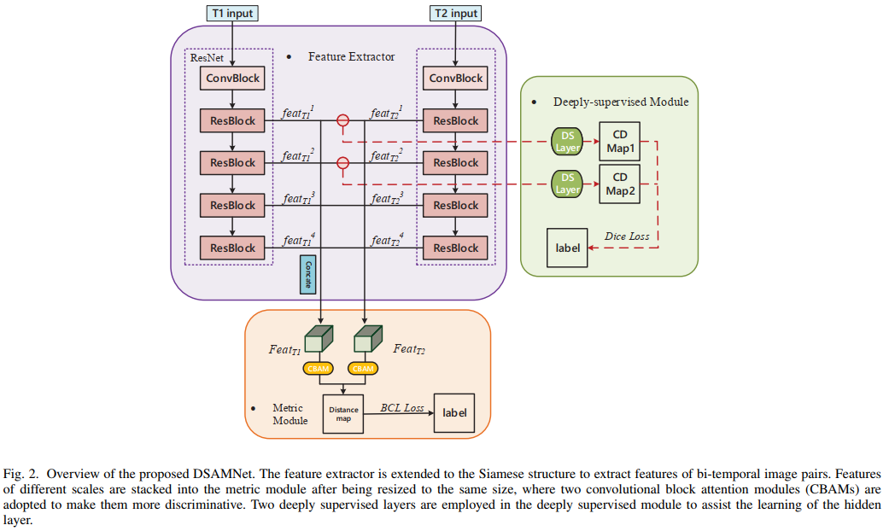
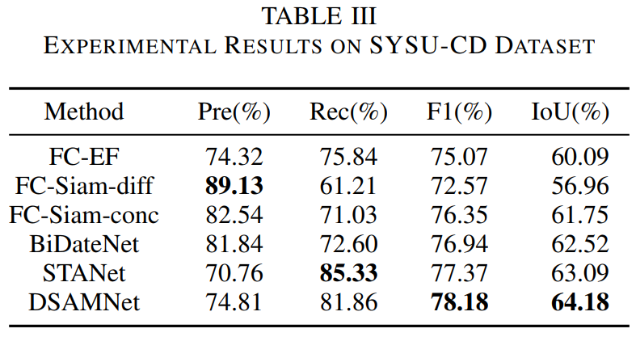

# DSAMNet
The pytorch implementation for "[A Deeply-supervised Attention Metric-based Network and an Open Aerial Image Dataset for Remote Sensing Change Detection](https://ieeexplore.ieee.org/document/9467555)" on [IEEE Transactions on Geoscience and Remote Sensing](https://ieeexplore.ieee.org/xpl/aboutJournal.jsp?punumber=36).


<br>

## Requirements
torch == 1.2.0
torchvision = 0.4.0


## Dataset: SYSU-CD ([download](https://github.com/liumency/SYSU-CD))

- The dataset contains 20000 pairs of 0.5-m aerial images of size 256×256 taken between the years 2007 and 2014 in Hong Kong. 
- The main types of changes in the dataset include: (a) newly built urban buildings; (b) suburban dilation; (c) groundwork before construction; (d) change of vegetation; (e) road expansion; (f) sea construction.

   

- Comparisons to existing change detection datasets 
   
   

<br>

## Experiments

### Method: DSAMNet
   


### Result

   


<br>

## Citation
If you find our work useful for your research, please consider citing our paper:
```
@ARTICLE{shi21deeply,
  author={Shi, Qian and Liu, Mengxi and Li, Shengchen and Liu, Xiaoping and Wang, Fei and Zhang, Liangpei},
  journal={IEEE Transactions on Geoscience and Remote Sensing}, 
  title={A Deeply Supervised Attention Metric-Based Network and an Open Aerial Image Dataset for Remote Sensing Change Detection}, 
  year={2021},
  volume={},
  number={},
  pages={1-16},
  doi={10.1109/TGRS.2021.3085870}}
```
